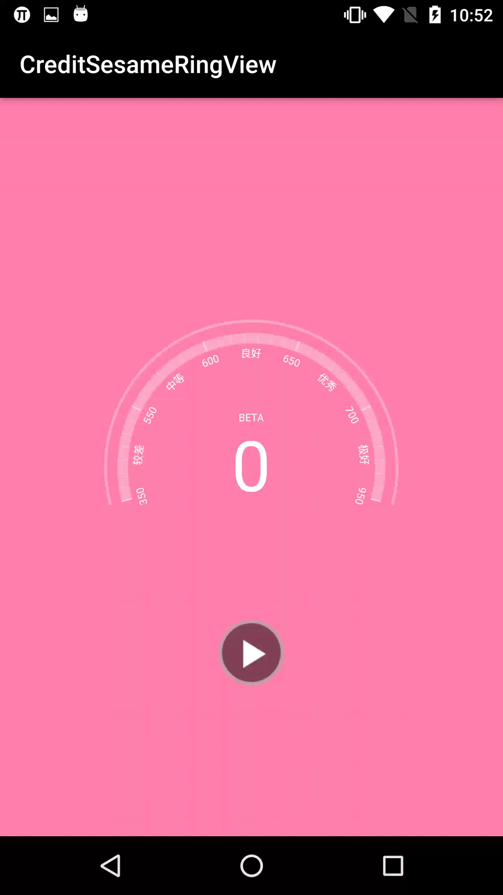
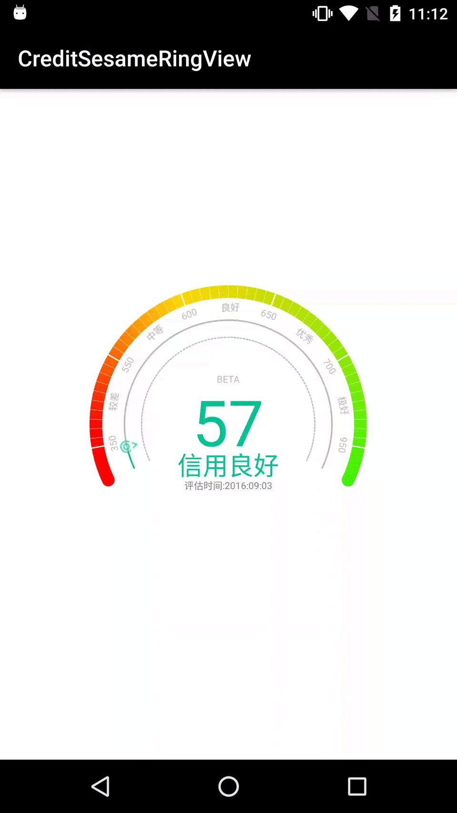
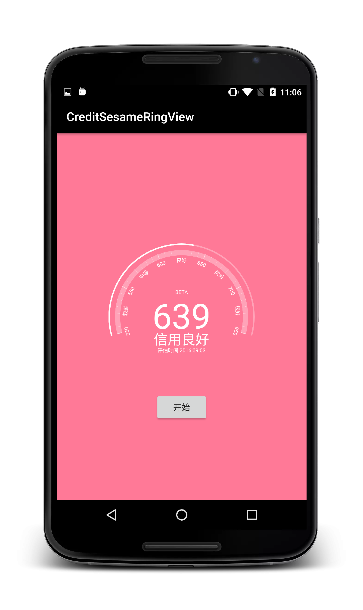
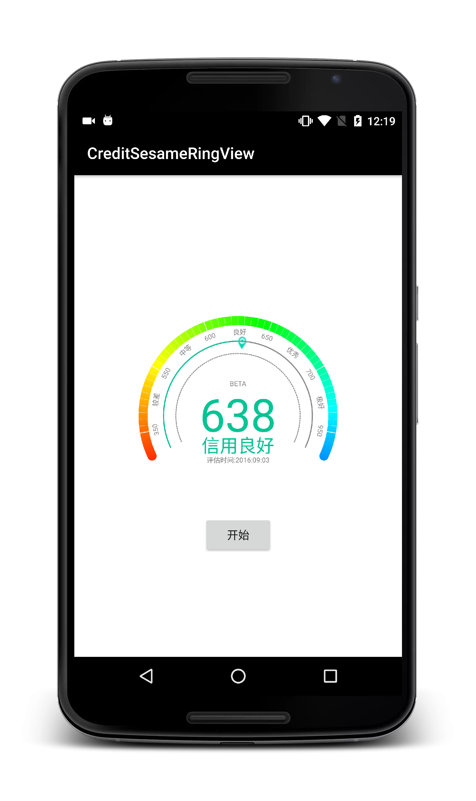

# CreditSesameRingView
Imitation of Ali credit sesame new old ring view.


## Screenshots Gif

<a href="art/01.gif"></a> <a href="art/02.gif"></a>

## Screenshots Png
<a href="art/03.png"></a> <a href="art/04.png"></a>


## Usage

 * add dependencies

```java

Add it in your root build.gradle at the end of repositories:

	allprojects {
		repositories {
			...
			maven { url "https://jitpack.io" }
		}
	}


Add the dependency

	dependencies {
	        compile 'com.github.HotBitmapGG:CreditSesameRingView:V1.0.1'
	}

```

 * Sted 1 A new version of used in the code.

```java

     // The gradient color can define your own
     private final int[] mColors = new int[]{
            0xFFFF80AB,
            0xFFFF4081,
            0xFFFF5177,
            0xFFFF7997
             };

      // Set up the need to score
      mLayout = (RelativeLayout) view.findViewById(R.id.layout);
      mButton = (Button) view.findViewById(R.id.btn);
      newCreditSesameView = (NewCreditSesameView) view.findViewById(R.id.sesame_view);
      mLayout.setBackgroundColor(mColors[0]);
      mButton.setOnClickListener(new View.OnClickListener()
      {

          @Override
           public void onClick(View view)
           {

               newCreditSesameView.setSesameValues(639);
               startColorChangeAnim();
           }
      });


     // The background color gradient animation Simply illustrates the effect Can customize according to your need
     public void startColorChangeAnim()
     {

         ObjectAnimator animator = ObjectAnimator.ofInt(mLayout, "backgroundColor", mColors);
         animator.setDuration(3000);
         animator.setEvaluator(new ArgbEvaluator());
         animator.start();
     }

```

  * Sted 2 A old version of used in the code.

```java

      // Set up the need to score
      oldCreditSesameView = (OldCreditSesameView) view.findViewById(R.id.sesame_view);
      mButton = (Button) view.findViewById(R.id.btn);
      mButton.setOnClickListener(new View.OnClickListener()
      {

          @Override
          public void onClick(View view)
          {

              oldCreditSesameView.setSesameValues(639);
          }
      });
```

## Other

  * 知了日报客户端: https://github.com/HotBitmapGG/RxZhiHu

  * 高仿BiliBili客户端: https://github.com/HotBitmapGG/OhMyBiliBili

  * Gank.IO客户端: https://github.com/HotBitmapGG/StudyProject

  * 妹子福利App: https://github.com/HotBitmapGG/MoeQuest

  * 圆环进度条:https://github.com/HotBitmapGG/RingProgressBar

  * 仿芝麻信用圆环进度: https://github.com/HotBitmapGG/CreditSesameRingView

  * 轻量级的RecycleViewAdapter辅助类库: https://github.com/HotBitmapGG/EasyRecycleAdapterHelper

## License

   Copyright 2016 HotBitmapGG

   Licensed under the Apache License, Version 2.0 (the "License"); you may not use this file except in compliance with the License. You may obtain a copy of the License at

   http://www.apache.org/licenses/LICENSE-2.0

   Unless required by applicable law or agreed to in writing, software distributed under the License is distributed on an "AS IS" BASIS, WITHOUT WARRANTIES OR CONDITIONS OF ANY KIND, either express or implied. See the License for the specific language governing permissions and limitations under the License.


